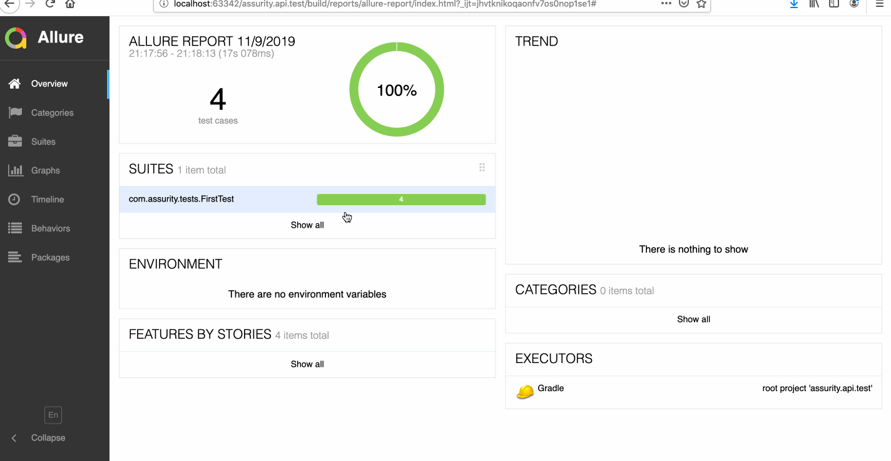

## assurity-api-tests
API Test Assignment given by Assurity

### How to use/Run 

- Clone the repo 
```shell
$ git clone https://github.com/spathare21/assurity-api-tests.git
```
 
```shell
$ cd assurity.api.test
```
- Run Below Command to run tests
```shell
$  ./gradlew clean test allureReport
```
- After completion open reports build/reports/allure-report/index.html
- You will see the reports like below 



### License
[Apache License](http://www.apache.org/licenses/LICENSE-2.0), Version 2.0